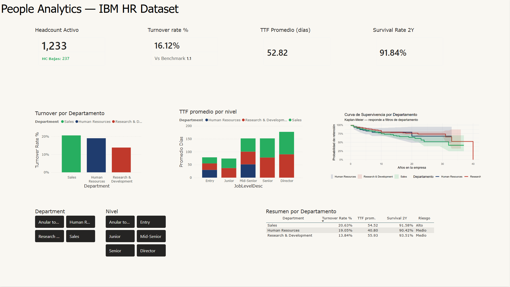
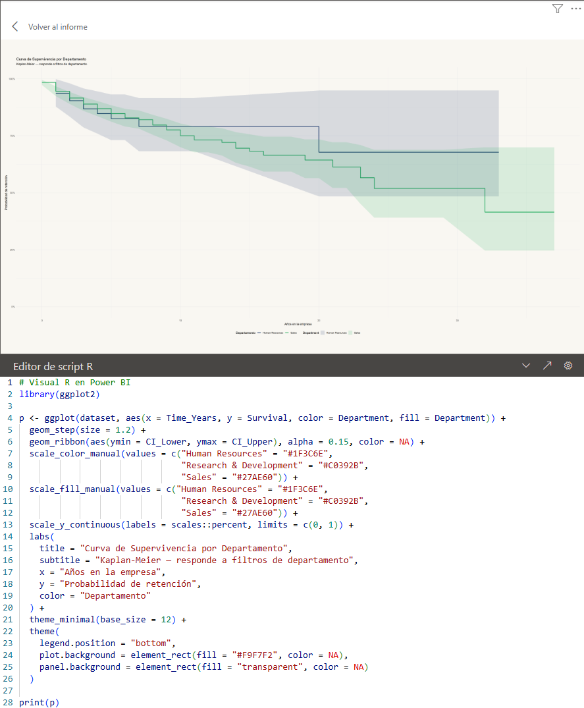
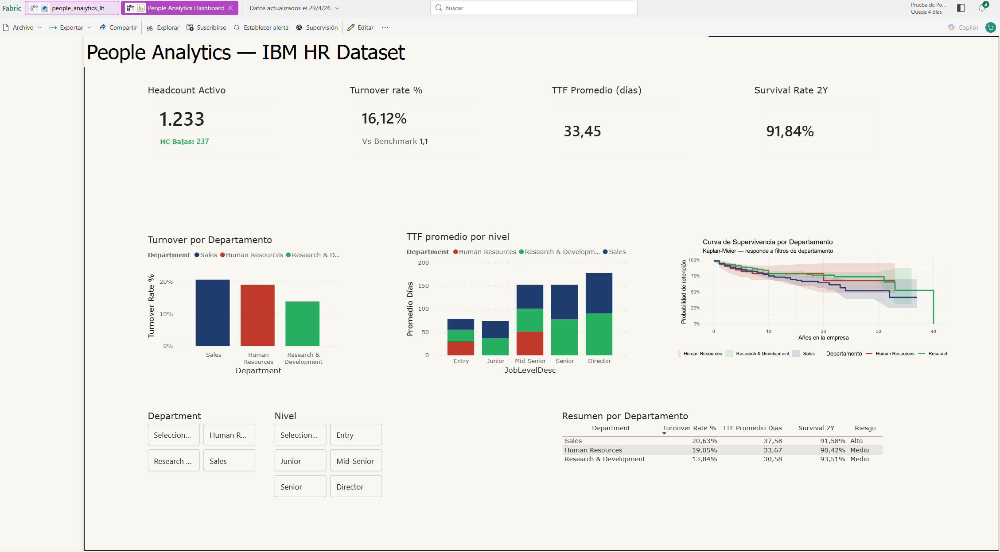
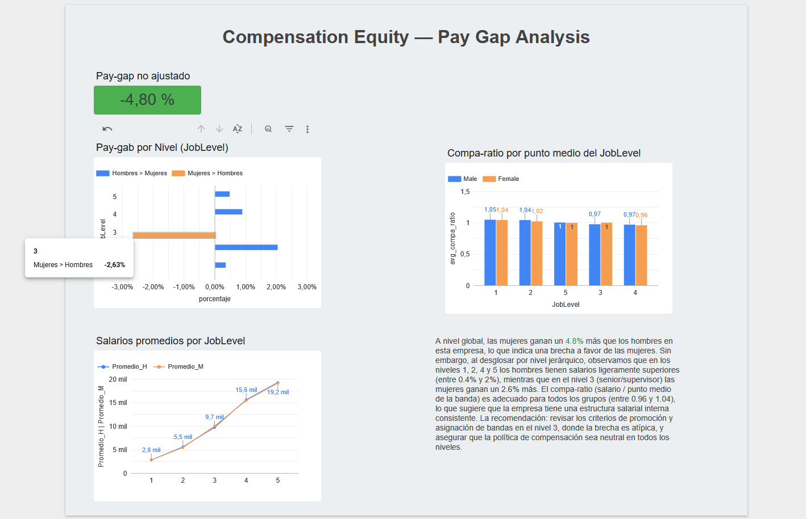

# People Analytics Lab — IBM HR Dataset


## 📌 Descripción

Laboratorio completo de **People Analytics** utilizando el dataset público IBM HR (1,470 empleados, 35 variables). El objetivo es demostrar un stack de análisis de datos de RRHH de nivel profesional, combinando **tres ecosistemas**:

- **Ecosistema Microsoft Local**: R + Python → Power BI Desktop (KPIs 1–3)
- **Ecosistema Google Cloud**: BigQuery SQL → Vistas → Looker Studio (KPI 4)
- **Ecosistema Microsoft Cloud**: Microsoft Fabric → OneLake → Power BI Service

Habilidades demostradas:
- Análisis estadístico con **R** (tidyverse, survival, survminer, regresión)
- Transformación y análisis con **Python** (pandas, lifelines, scikit-learn, faker)
- Modelado dimensional (Constellation Schema con Conformed Dimensions)
- SQL avanzado en **BigQuery** (CTEs, window functions, APPROX_QUANTILES, vistas semánticas)
- Ingesta y ETL en la nube con **Microsoft Fabric** (Lakehouse, Dataflow Gen2, Delta Lake)
- Visualización y storytelling en **Power BI** y **Looker Studio**
- Control de versiones con **Git/GitHub**

---

## 🛠️ Stack Tecnológico

### Ecosistema Microsoft Local (KPIs 1–3)
| Capa | Herramienta | Uso |
|------|-------------|-----|
| Análisis estadístico | R (tidyverse, survival, survminer) | Kaplan-Meier, regresión, visualización estadística |
| Transformación | Python (pandas, faker, scikit-learn) | ETL, simulación de datos, modelos predictivos |
| Modelado | Power BI (Power Query, DAX) | Modelo estrella, medidas, relaciones |
| Visualización | Power BI Desktop + Visual R | Dashboard ejecutivo con visual R interactivo |

### Ecosistema Google Cloud (KPI 4)
| Capa | Herramienta | Uso |
|------|-------------|-----|
| Almacenamiento | BigQuery | Dataset IBM HR como tabla nativa |
| Transformación | BigQuery SQL (CTEs) | Pay gap, compa-ratio |
| Capa semántica | Vistas en BigQuery | Fuente de datos para Looker Studio |
| Visualización | Looker Studio | Dashboard de compensación y equidad |

### Ecosistema Microsoft Cloud — Fabric (prueba gratuita)
| Capa | Herramienta | Equivalente Enterprise |
|------|-------------|----------------------|
| Almacenamiento | OneLake + Lakehouse | Azure Data Lake Storage Gen2 |
| Formato | Delta Lake (Parquet) | Delta Lake / Azure Synapse |
| ETL en nube | Dataflow Gen2 | Azure Data Factory |
| Conexión | SQL endpoint + OAuth 2.0 / Azure AD | Azure SQL DB con Entra ID |
| Publicación | Power BI Service en Fabric | Power BI Premium / Fabric F-SKU |
| Refresco | Scheduled Refresh automático (sin Gateway) | Refresco cloud nativo |

> 📄 **Documentación detallada del laboratorio Fabric:** [`docs/azure-fabric/README.md`](docs/azure-fabric/README.md)

> **Nota sobre modelado**: La lógica de negocio compleja (ratios, promedios ponderados, regresiones) se resuelve en la capa de datos antes de llegar a la visualización — en BigQuery con SQL, en Fabric con Dataflow Gen2, y en Power BI local con Power Query + DAX.

---

## 📊 Dashboard Interactivo — Power BI Local (KPIs 1–3)

Modelo de datos con esquema Constellation (múltiples tablas de hechos con Conformed Dimensions):

```
FactEmpleados ──→ DimDepartment ←── FactTTF
FactEmpleados ──→ DimJobLevel   ←── FactTTF
FactEmpleados ──→ DimGender
                  DimDepartment ←── FactSurvival
```



### 🧠 Detalle técnico — Visual R (Kaplan-Meier en Power BI)
- **Datos**: Exportados desde R como tabla plana `survival_by_dept_R.csv` con columnas `Time_Years`, `Survival`, `CI_lower`, `CI_upper`, `Department` (filtrado a ≤15 años)
- **Visual**: Script R con `ggplot2` + `geom_step` + `geom_ribbon` dentro de Power BI Desktop
- **Interactividad**: Responde a segmentaciones de departamento manteniendo asignación cromática consistente
- **DAX clave**: TTF Promedio usa promedio ponderado (`SUMX(FactTTF, avg_ttf * n_vacantes) / SUM(n_vacantes)`) — no `AVERAGE` simple



---

## ☁️ Dashboard en la Nube — Microsoft Fabric (KPIs 1–3)

El mismo dashboard local fue migrado a **Microsoft Fabric** como extensión Enterprise del laboratorio. Los datos viven en OneLake, el ETL corre en la nube y el reporte se consume desde el servicio sin depender de una máquina local.

**Componentes implementados:**
- Lakehouse `people_analytics_lh` en OneLake con tabla Delta `ibm_hr_raw`
- Dataflow Gen2 para ETL en nube (`Dataflow_PeopleAnalytics_IBM`)
- Modelo semántico publicado con Constellation Schema (9 tablas: 4 Dims + 4 Facts + _Medidas)
- Conexión via SQL endpoint de Fabric con autenticación OAuth 2.0 / Azure AD
- Refresco programado diario a las 8:30 a.m. UTC-6 (sin On-premises Gateway)



> 📄 **Ver arquitectura, tipos de conexión y screenshots:** [`docs/azure-fabric/README.md`](docs/azure-fabric/README.md)

---

## 📊 Dashboard Pay Equity — Looker Studio + BigQuery (KPI 4)

Primer KPI del ecosistema Google. Las transformaciones se resuelven en BigQuery como vistas semánticas; Looker Studio solo visualiza.

**Hallazgos principales:**
- Gap no ajustado: las mujeres ganan un **4.8% más** que los hombres a nivel global
- Controlando por JobLevel: en niveles 1, 2, 4 y 5 los hombres tienen salarios superiores (0.4%–2%)
- Nivel 3 (Mid-Senior): las mujeres ganan un 2.6% más — anomalía que requiere revisión
- Compa-ratio: entre 0.96 y 1.04 en todos los grupos → estructura salarial interna consistente
- **Conclusión**: el problema no es la política salarial sino el acceso a promociones en niveles senior



**SQL clave (BigQuery):**
```sql
-- Compa-ratio con punto medio de banda por nivel
WITH puntomedio AS (
  SELECT JobLevel,
    APPROX_QUANTILES(MonthlyIncome, 100)[OFFSET(50)] AS mediana_income
  FROM `proyecto.dataset.IBM_HR`
  GROUP BY JobLevel
)
SELECT df.JobLevel, df.Gender,
  ROUND(AVG(df.MonthlyIncome / p.mediana_income), 3) AS avg_compa_ratio
FROM `proyecto.dataset.IBM_HR` df
JOIN puntomedio p ON df.JobLevel = p.JobLevel
GROUP BY df.JobLevel, df.Gender
ORDER BY df.Gender, df.JobLevel
```

---

## 📋 KPIs Implementados

| # | KPI | Técnica | Stack | Archivo |
|---|-----|---------|-------|---------|
| 1 | Turnover Rate por departamento | Análisis descriptivo + semáforo de riesgo | R + Python → Power BI + Fabric | `scripts/01_kpi1_turnover.R` |
| 2 | Time-to-Fill simulado | Simulación con benchmarks + costo por vacante | Python → Power BI (DAX ponderado) | `scripts/02_kpi2_ttf.R` |
| 3 | Survival Analysis (retención) | Kaplan-Meier + intervalos de confianza | R (survminer) → Power BI Visual R | `scripts/03_kpi3_survival.R` |
| 4 | Pay Equity — brecha salarial | CTEs + APPROX_QUANTILES + compa-ratio | BigQuery SQL → Looker Studio | `sql/04_kpi4_pay_equity_bigquery.sql` |
| 5 | Headcount Forecast | Proyección 12 meses con tasa de cobertura | Python → Power BI | `scripts/05_kpi5_forecast.R` |
| 6 | Diversidad e Inclusión | Pipeline D&I + attrition disparity ratio | R + Python | `scripts/06_kpi6_diversity.R` |
| 7 | Engagement Index / eNPS proxy | Índice ponderado + segmentación Promoters/Detractors | R + Python | `scripts/07_kpi7_engagement.R` |
| 8 | Absenteeism + Bradford Factor | Síntesis con predictores reales | R + Python | `scripts/08_kpi8_absenteeism.R` |

---

## 🚀 Cómo usar este repositorio

### Requisitos
- **R** (>= 4.0): tidyverse, survival, survminer, ggplot2, dplyr, readr
- **Python** (>= 3.9): pandas, numpy, matplotlib, seaborn, lifelines, faker, scikit-learn
- **Power BI Desktop** (para visualizar el dashboard .pbix)
- **Cuenta Google Cloud** con BigQuery habilitado (free tier suficiente)
- **Looker Studio** (lookerstudio.google.com — gratuito)
- **Microsoft Fabric** (trial gratuito de 60 días en app.powerbi.com)

### Estructura del repositorio
```
people-analytics-lab/
├── data/
│   └── WA_Fn-UseC_-HR-Employee-Attrition.csv
├── scripts/          # Scripts R por KPI
├── python/           # Scripts Python por KPI
├── sql/              # Queries BigQuery por KPI
├── outputs/
│   ├── tablas/       # CSVs exportados por KPI
│   └── graficos/     # Imágenes PNG por KPI
├── dashboard/        # Archivo .pbix Power BI
├── docs/
│   ├── images/       # Capturas del dashboard local
│   └── azure-fabric/ # Laboratorio Microsoft Fabric
│       ├── README.md           ← documentación detallada
│       └── screenshots/        ← capturas del entorno Fabric
└── README.md
```

### Ejecutar los análisis
```bash
# 1. Clonar el repositorio
git clone https://github.com/LuisCeja1286/DataInsightsPortfolio.git

# 2. Ejecutar setup de Python
python scripts/00_setup.py

# 3. Ejecutar KPIs en orden (R)
Rscript scripts/01_kpi1_turnover.R
Rscript scripts/02_kpi2_ttf.R
Rscript scripts/03_kpi3_survival.R

# 4. Para KPI 4: ejecutar SQL en BigQuery Console

# 5. Para la capa Fabric: ver docs/azure-fabric/README.md
```

---

## 📈 Próximos pasos

- [ ] Actualizar dashboard con KPIs 4 y 5 (Pay Equity + Headcount Forecast)
- [ ] Completar KPIs 6–8 en ecosistema Google (BigQuery + Looker Studio)
- [ ] Implementar Row-Level Security (RLS) en modelo semántico de Fabric
- [ ] Data Pipeline en Fabric para orquestación Bronze → Silver → Gold
- [ ] Pay gap ajustado con **BigQuery ML** (`CREATE MODEL` + `linear_reg`)
- [ ] Preparar para certificación **DP-600 Fabric Analytics Engineer Associate**

---

*Dataset: [IBM HR Analytics Employee Attrition & Performance](https://www.kaggle.com/datasets/pavansubhasht/ibm-hr-analytics-attrition-dataset) — Kaggle*
*Autor: Ing. Luis Alberto Ceja de León — [LinkedIn](https://www.linkedin.com/in/lceja21) | [GitHub](https://github.com/LuisCeja1286)*